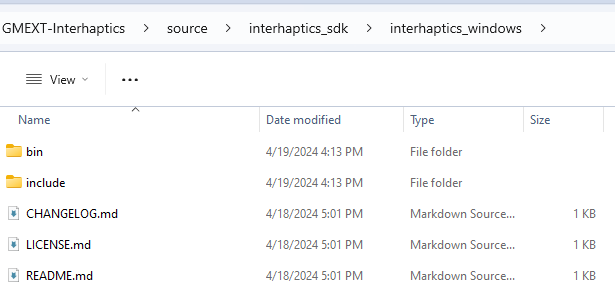
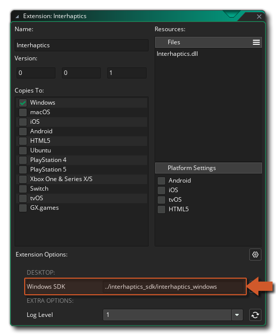

@title Setting Up

# Setup

This guide shows how to set up the Interhaptics extension for Gamemaker.

## Downloading the SDK

[[Note: Before you can access the GitHub repository with the SDK releases you'll be asked to provide some required information.]]

1. Go to https://www.interhaptics.com/download/ to download the **Game Engine SDK**.
2. On the Download page, under the **Game Engine SDK** option, click **GitHub**.
3. Enter the required information, then click **Download on GitHub**.
4. On the GitHub page that opens next, click the latest release link under Releases.
5. On the next page, under `Assets`, download the `Source code (zip)` package.
6. Extract the zip contents to `GMEXT-Interhaptics/source/interhaptics_sdk`.

After extracting the SDK contents to the folder, the folder's contents should look as follows: 

## Setting Up GameMaker

Download the [latest release](github.com/YoYoGames/GMEXT-Interhaptics/releases/latest) of the extension.

In GameMaker, open an existing project or create a new one. Next add the extension to the project.

In the [Extension Options](https://manual.gamemaker.io/monthly/en/The_Asset_Editors/Extensions.htm#extension_options), set the Windows SDK to the correct relative folder path: `../interhaptics_sdk/interhaptics_windows`.

